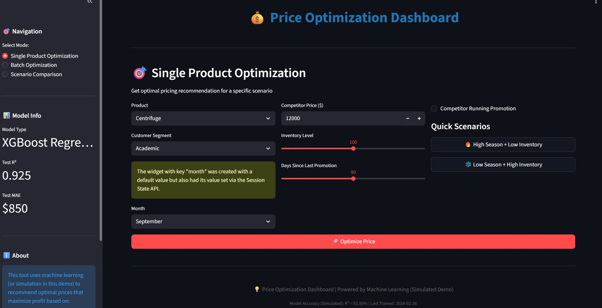
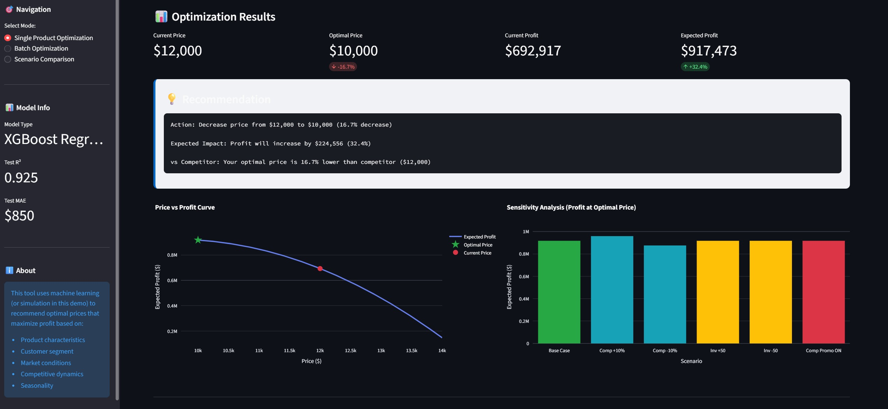

# Price Optimizer & Recommender

A proof-of-concept **Price Optimization Dashboard** for laboratory equipment, demonstrating how machine learning can recommend optimal selling prices to maximize profit — factoring in product type, customer segment, market conditions, competitive dynamics, and seasonality.

> **Note:** This is a demo built on mock models and synthetic data. The simulated prediction logic lives alongside the Streamlit frontend in `app.py`. Replacing the mock functions with a trained ML model and preprocessor pipeline is all that's needed to move to production.

---

## Dashboard Preview



---

## Features

**Three optimization modes** (accessible from the sidebar):

- **Single Product Optimization** — compute the optimal price for a given scenario, visualize the price-profit curve, and receive actionable recommendations.
- **Batch Optimization** — run price optimization across multiple products simultaneously and export results as a CSV.
- **Scenario Comparison** — compare optimal pricing outcomes across predefined market scenarios side by side.

**Under the hood:**
- A mocked prediction engine that simulates profit using heuristics, so the dashboard runs without any serialized model files.
- Feature engineering utilities mirroring training-time preprocessing (price ratios, season flags, encoded segments, etc.).
- Jupyter notebooks for EDA, feature engineering experiments, and model development.
- A synthetic data generator script to fabricate lab equipment pricing datasets.




---

## Getting Started

### Prerequisites

- Python 3.10+ (the dev container runs Ubuntu 24.04 with Python 3.12)
```bash
pip install -r requirements.txt
```

### Running the App
```bash
streamlit run app.py
```

Then open the URL shown in the terminal (typically `http://localhost:8501`) and explore the three modes from the sidebar.

### Developing & Re-training
1. Use the Jupyter notebooks for step-by-step analysis and training workflows:
   - `EDA.ipynb` — exploratory data analysis
   - `Feature-Engineering.ipynb` — feature engineering experiments
   - `Modelling.ipynb` — model development and evaluation
2. When a real model is ready, export it as a `.pkl` (along with the scaler), then update `app.py` to load them in place of the mocks.

---

## Repository Structure
```
app.py                               # Streamlit dashboard (entry point)
requirements.txt                     # Python dependencies

# raw and processed data samples
lab_equipment_pricing.csv            # sample pricing dataset used in notebooks

# metadata files used by the app and preprocessing
Model/model_metadata.json            # metadata template consumed by `app.py`
"Feature Engineering"/feature_metadata.json  # feature order template for preprocessing

# project subfolders with supporting notebooks and artifacts
"Feature Engineering"/              # feature engineering experiments & outputs
   EDA.ipynb                        # exploratory data analysis notebook
   Feature-Engineering.ipynb        # feature creation and transformation steps
   lab_equipment_pricing_features.csv  # feature‑engineered sample data

Model/                                # model development and evaluation
   Modelling.ipynb                   # model training notebook
   (placeholders)                   # trained model (`.pkl`) and scaler files live here in practice
```

---

For questions or improvements, feel free to open an issue or pull request.
